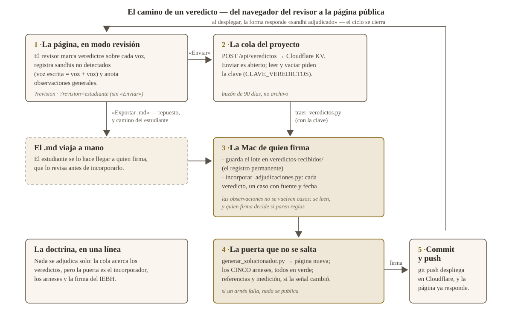

# La automatización de los veredictos — grado medio

*Decisión del IEBH (2026-08-28): los veredictos del modo revisión viajan
solos hasta una cola del proyecto; la incorporación, los arneses y la firma
siguen siendo la puerta. El grado completo (que un veredicto se convierta en
caso publicado sin pasar por la Mac) queda para después, si el uso lo pide.*

## Cómo funciona

1. El revisor, en `/recursos/solucionador/?revision`, marca veredictos y
   pulsa **«Enviar N veredictos al proyecto»**. El navegador hace `POST`
   a `/api/veredictos` y el worker guarda el `.md` en la cola (KV, 90 días).
   No hace falta clave para enviar: la cola sólo se **lee** con clave, y
   nada de lo enviado toca el proyecto por sí solo. «Exportar .md» sigue
   existiendo como camino manual (y es el repuesto si la cola no responde).
2. En la Mac, quien firma corre el ciclo COMPLETO con **una orden**
   (2026-08-29 — la independencia de quien firma):

       VEREDICTOS_CLAVE=… python3 herramientas/ciclo_veredictos.py

   Recoge e incorpora, re-vierte las referencias que los casos nuevos
   toquen, regenera la página, corre los cinco arneses y, sólo con todo
   en verde, hace el commit y el push (que despliega). Ante el primer
   fallo se detiene sin publicar nada. `--sin-push` deja el commit hecho
   sin empujarlo. El paso a paso sigue disponible:

       VEREDICTOS_CLAVE=… python3 herramientas/traer_veredictos.py

   Eso guarda cada entrada en `docs/solucionador/veredictos-recibidos/`
   (registro permanente), la pasa por `incorporar_adjudicaciones.py` (que
   avisa de veredictos ilegibles y no toca formas ya adjudicadas) y retira
   de la cola sólo lo incorporado sin error. `--solo-mirar` lista sin tocar.
3. Después, lo de siempre: `generar_solucionador.py`, `arnes_casos.js`
   (y referencias/arneses/medición si la señal cambió), commit y push.
   **Nada se adjudica sin ese paso.**

Las **Observaciones del revisor** y las **notas** de cada veredicto no se
vuelven casos: el incorporador las ignora a propósito. Quedan en los
archivos recibidos para leerse y, si quien firma lo decide, convertirse en
reglas generales — como salió la de los absolutivos en -tvā/-tvāna.

## Cómo se activa (una sola vez, en la Mac)

    npx wrangler kv namespace create VEREDICTOS
    #  → imprime un "id"; descomentar el bloque kv_namespaces de
    #    wrangler.jsonc y poner ese id
    npx wrangler secret put CLAVE_VEREDICTOS
    #  → la clave que sólo conoce quien recoge la cola
    git add -A && git commit && git push

Hasta entonces el sitio funciona igual: `/api/veredictos` responde 503 y el
botón «Enviar» lo dice y remite a «Exportar .md».

## Qué guardar en secreto

La clave (`CLAVE_VEREDICTOS`) sólo la conoce quien recoge. Si se filtrara,
lo peor posible es que alguien LEA o VACÍE la cola — no puede publicar ni
adjudicar nada: eso sigue pidiendo la Mac, los arneses y la firma. Enviar a
la cola es abierto a propósito; una entrada basura se descarta al mirarla
(y el incorporador la rechaza sola si no trae `VEREDICTO:` legibles).
